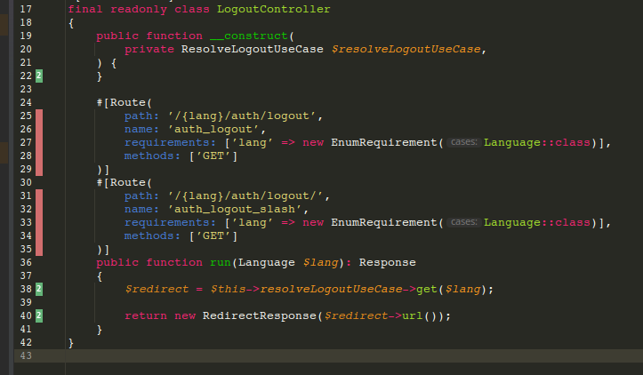

# Per-Line Coverage Info - Raketa Edition

*Плагин разработан для Raketa (raketa.travel)

Это плагин для PhpStorm, который показывает покрытие PHP тестами прямо в редакторе.

<!-- Plugin description -->
Shows per-line PHP test coverage inline in the editor. Downloads coverage artifacts
from GitLab CI pipelines, caches them locally, and renders gutter icons and line backgrounds
for covered, uncovered, and feature-only lines. Click any covered line to see which tests
execute it — with one-click test re-run. Supports dual-coverage mode that highlights tests
new on the feature branch versus the base branch.
<!-- Plugin description end -->

## Table of Contents
- [Проблема](#проблема)
- [Возможности](#возможности)
- [Скриншоты](#скриншоты)
- [Установка](#установка)
- [Требования](#требования)
- [Разработка](#разработка)
- [Авторы](#авторы)

## Проблема

В компании Raketa десятки микросервисов, каждый со своими Behat-тестами.
CI гоняет тесты при каждом пуше, собирает coverage в `.covt`-файлы и
загружает в GitLab pipeline artifacts. Чтобы понять, какие строки покрыты
тестами, а какие нет — приходилось либо гонять тесты локально (долго),
либо лезть в CI (неудобно).

**Per-Line Coverage Info** решает эту проблему:

- Автоматически находит подходящий пайплайн в GitLab по текущей ветке
- Скачивает coverage-артефакты (.covt.gz)
- Кеширует на диске в бинарном формате (.cov4) для быстрого доступа
- Рисует в gutter зелёные/красные/синие полоски напротив каждой строки
- По клику на covered line — список тестов, которые её выполняют
- Тесты можно запустить прямо из попапа (Run / Debug)

**Как это работает:**

```
CI (Behat with pcov) → .covt → GitLab Artifacts
                                       ↓
                              PhpStorm Plugin
                                       ↓
                            .cov4 cache (local)
                                       ↓
                         gutter markers + line highlights
```

## Возможности

- **Inline coverage** — gutter полоски и подсветка строк: 🟢 covered, 🔴 uncovered, 🔵 feature-only
- **Per-line tests** — клик на covered line → панель "Covering Line" со списком тестов
- **Run/Debug тестов** — одно кнопкой из попапа, без поиска feature-файла
- **Dual-coverage mode** — сравнение покрытия ветки с master; синие линии = тесты, новые на ветке
- **Affected by Changes** — таб, показывающий тесты, которые нужно перезапустить после изменений
- **Компоненты** — фильтрация по микросервисам (api/avia, api/hotels, raketa и т.д.)
- **Автообновление** — pipeline poller: появление нового пайплайна → авто-перезагрузка coverage
- **Offline-first** — stale coverage из кеша моментально, свежее из GitLab в фоне
- **Свой репозиторий** — автообновления плагина через GitHub Pages (без Marketplace)

## Скриншоты



## Установка

### Вариант A — свой репозиторий плагинов (рекомендуется, с автообновлением)

1. **Settings → Plugins**
2. **⚙ (gear) → Manage Plugin Repositories…**
3. Нажать **+** и добавить URL: `https://pastila.github.io/per-line-coverage-info/updatePlugins.xml`
4. Открыть вкладку **Marketplace**, найти `Per-Line Coverage Info`, установить и перезапустить IDE.

Новые версии подхватываются автоматически, как из обычного Marketplace.

> **Если плагин раньше ставился из репозитория yakov255** — в **Manage Plugin Repositories…**
> замените `https://yakov255.github.io/per-line-coverage-info/updatePlugins.xml` на адрес выше.
> ID плагина не изменился, поэтому настройки и кеш покрытия сохранятся, а обновление встанет поверх.
> Начиная с 2.8.0 плагин и сам проверяет обновления по новому адресу.

### Вариант B — установка из ZIP

1. Скачать `per-line-coverage-info-<версия>.zip` со [страницы релизов](https://github.com/pastila/per-line-coverage-info/releases)
2. **Settings → Plugins → ⚙ → Install Plugin from Disk…**
3. Выбрать `.zip`, перезапустить IDE

## Требования

- IntelliJ IDEA Ultimate 2025.2+
- PHP plugin
- GitLab доступ (Personal Access Token с `read_api` и `read_repository`)

## Разработка

```bash
./gradlew compileKotlin   # компиляция
./gradlew test            # тесты
./gradlew buildPlugin     # сборка .zip
./gradlew runIde          # запуск тестовой IDE
```

## Авторы

- **Yakov Vladimirov** — автор плагина: [github.com/yakov255](https://github.com/yakov255)
- **Evgenii Bukin** — сопровождение: [github.com/pastila](https://github.com/pastila)

Репозиторий: [github.com/pastila/per-line-coverage-info](https://github.com/pastila/per-line-coverage-info) ·
[Issues](https://github.com/pastila/per-line-coverage-info/issues) ·
[Releases](https://github.com/pastila/per-line-coverage-info/releases)

## Лицензия

MIT
